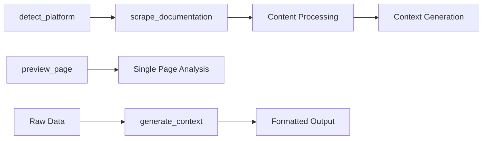
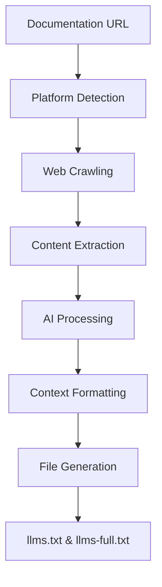

# 📝 Context Generator MCP Server - Project Overview

## 🎯 Project Mission

The **Context Generator MCP Server** is a specialized Model Context Protocol (MCP) server designed to scrape documentation websites and generate context files optimized for Large Language Model (LLM) consumption. Built by Pink Pixel, this server transforms scattered web documentation into structured, LLM-friendly formats.

## 🏗️ Architecture Overview

### Core Components

```
context-generator-mcp/
├── src/
│   ├── index.ts                     # Main MCP server entry point
│   ├── services/                    # Core business logic services
│   │   ├── crawler.ts               # Web crawling with x-crawl
│   │   ├── platformDetector.ts      # Documentation platform detection
│   │   ├── contentExtractor.ts      # Content extraction & cleaning
│   │   └── contextFormatter.ts      # Context format generation
│   ├── types/                       # TypeScript type definitions
│   │   └── index.ts                 # Main type exports
│   └── utils/                       # Utility functions
│       ├── index.ts                 # Utility exports
│       └── platformTests.ts         # Platform detection tests
├── dist/                            # Compiled JavaScript output
└── output/                          # Generated context files
```

### Service Architecture

The server follows a clean, service-oriented architecture:

1. **🕷️ CrawlerService** - Handles web crawling using x-crawl
2. **🔍 PlatformDetectorService** - Detects documentation platforms (GitBook, Docusaurus, etc.)
3. **🧹 ContentExtractorService** - Extracts and cleans content from HTML
4. **📝 ContextFormatterService** - Formats content into LLM-optimized contexts

## 🛠️ MCP Tools

### Primary Tools

| Tool | Purpose | Input | Output |
|------|---------|-------|--------|
| `scrape_documentation` | Complete site crawling | URL + options | Context files |
| `preview_page` | Single page analysis | URL | Content preview |
| `detect_platform` | Platform identification | URL | Platform details |
| `generate_context` | Format raw crawl data | Crawl results | Formatted context |

### Tool Flow



## 🧠 AI Integration

### Supported Providers

1. **🦙 Ollama (Recommended)**
   - **Privacy**: All data stays local
   - **Cost**: No API fees
   - **Speed**: Local processing
   - **Models**: llama3.1, codellama, etc.

2. **🤖 OpenAI**
   - **Power**: Latest GPT models
   - **Cloud**: Managed service
   - **Cost**: Pay-per-use

### AI Features

- **Smart Content Enhancement**: AI-powered content extraction
- **Platform Optimization**: AI-assisted platform detection
- **Context Refinement**: LLM-optimized formatting

## 📊 Data Flow



## 🔧 Key Technologies

### Core Stack
- **TypeScript**: Type-safe development
- **x-crawl**: Robust web crawling
- **Cheerio**: HTML parsing and manipulation
- **Turndown**: HTML to Markdown conversion
- **MCP SDK**: Model Context Protocol implementation

### AI Stack
- **Ollama**: Local AI processing
- **OpenAI API**: Cloud-based AI
- **Custom AI Integration**: Flexible provider system

## 📁 Output Formats

### Context File Types

1. **📋 Summary Format (`llms.txt`)**
   - ~300 characters per section
   - Optimized for token limits
   - Quick reference format

2. **📚 Full Format (`llms-full.txt`)**
   - Complete documentation content
   - Comprehensive details
   - Full context preservation

3. **🔄 Both Formats**
   - Generates separate files
   - Maximum flexibility
   - Use case optimization

### File Structure

```
output/
├── docs-example-com-summary-2025-01-10.txt
├── docs-example-com-full-2025-01-10.txt
└── docs-example-com-summary-2025-01-10.md
```

## 🎯 Use Cases

### Primary Use Cases

1. **📖 Documentation Analysis**
   - Extract content from documentation sites
   - Analyze documentation structure
   - Generate LLM-ready formats

2. **🤖 AI Training Data**
   - Prepare documentation for AI training
   - Create structured learning materials
   - Generate context-aware datasets

3. **📚 Knowledge Base Creation**
   - Build centralized documentation
   - Create searchable content
   - Generate reference materials

4. **🔍 Content Research**
   - Analyze competitor documentation
   - Study documentation patterns
   - Extract best practices

## ⚙️ Configuration

### Environment Variables

| Variable | Purpose | Default | Required |
|----------|---------|---------|----------|
| `OLLAMA_MODEL` | Local AI model | `llama3.1` | Optional |
| `OLLAMA_BASE_URL` | Ollama server URL | `http://localhost:11434` | Optional |
| `OPENAI_API_KEY` | OpenAI API access | - | Optional |
| `OPENAI_MODEL` | OpenAI model | `gpt-3.5-turbo` | Optional |

### MCP Client Configuration

```json
{
  "context-generator": {
    "command": "node",
    "args": ["/path/to/context-generator/dist/index.js"],
    "env": {
      "OLLAMA_MODEL": "llama3.1"
    }
  }
}
```

## 🚀 Performance Characteristics

### Crawling Performance
- **Single Page**: 1-3 seconds
- **Small Sites** (10-50 pages): 30-120 seconds
- **Large Sites** (100+ pages): 5-30 minutes

### Resource Usage
- **Memory**: ~50-200MB during crawling
- **Storage**: Context files typically 10-100KB per page
- **Network**: Respects rate limits (1s delay default)

## 🔒 Security & Privacy

### Data Protection
- **Local Processing**: Ollama keeps data on-device
- **No Data Retention**: Server doesn't store crawled content
- **Secure Crawling**: Respects robots.txt and rate limits

### Best Practices
- Use absolute paths for file operations
- Validate all URLs before processing
- Implement proper error handling
- Monitor resource usage

## 🎨 Pink Pixel Branding

**Made with ❤️ by Pink Pixel**

- **Website**: [pinkpixel.dev](https://pinkpixel.dev)
- **Tagline**: "Dream it, Pixel it"
- **Signature**: All outputs include Pink Pixel attribution
- **Modern Approach**: Elegant, stylized, contemporary solutions

## 📈 Future Roadmap

### Planned Features
- Enhanced platform detection
- Advanced AI integration
- Performance optimizations
- Extended output formats
- Batch processing capabilities

### Community Focus
- Open source development
- Community contributions
- Documentation improvements
- Example integrations

---

*This overview provides a comprehensive understanding of the Context Generator MCP Server architecture, capabilities, and usage patterns. For detailed implementation information, see the individual documentation files.*
